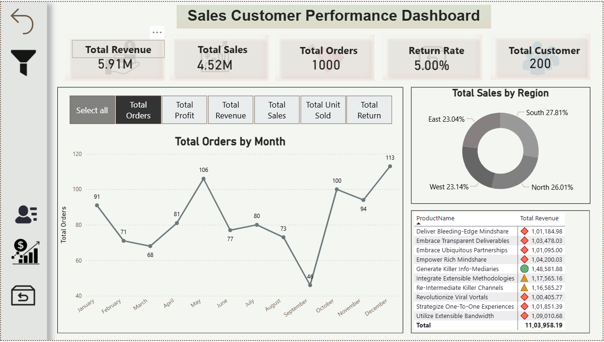

# 📊 Sales & Customer Intelligence Dashboard (Power BI)

A comprehensive **Power BI Desktop project** designed to deliver **data-driven insights** into **Sales, Returns, Customer Behavior, and Regional Performance** over the last **three years**.  
This dashboard follows **industry-standard data modeling**, **advanced DAX calculations**, and **executive-level visualization practices**.

---
---

### 🔗 Live Dashboard: 
#### https://app.powerbi.com/view?r=eyJrIjoiMTg3ODAzM2QtYmQwYS00YzcwLWFiMDUtMmJkZDM0NmJkNTk3IiwidCI6ImNmZDY4M2U1LTc5YWItNDc3Yy1hODE4LWNkNTRmZjIxMmE4ZiJ9 
---
---

## 🧠 Project Objective

To build an **interactive and scalable business intelligence solution** that enables senior leadership to:
- Monitor overall sales and profitability
- Understand customer behavior
- Analyze product and regional performance
- Track returns and seasonal trends
- Make confident, data-driven decisions

---

## 🏷️ Project Name

**Final Project – Sales & Customer Intelligence Dashboard**

---

## 🛠️ Tools & Technologies

- **Power BI Desktop**
- **DAX (Data Analysis Expressions)**
- **Power Query (ETL)**
- **Excel (Data Source)**

---

## 🗂️ Dataset Overview

The project uses structured Excel datasets organized into **Fact and Dimension tables**:

| Table Name       | Description |
|------------------|-------------|
| `Sales_Fact`     | Sales transactions (amount, quantity, cost) |
| `Returns_Fact`   | Product return details |
| `Customer_Dim`   | Customer profiles & segmentation |
| `Product_Dim`    | Product categories and pricing |
| `Region_Dim`     | Regional and manager information |
| `Date_Dim`       | Calendar table for time intelligence |

---

## 🧩 Data Modeling (Star Schema)

- Implemented a **clean Star Schema**
- One-to-Many relationships between Fact and Dimension tables
- Hidden technical columns for a clean report view
- Consistent naming conventions for scalability

📌 **Model Highlights**
- Optimized performance
- Easy filtering and drill-down
- Best practices followed

---

## 📐 DAX Measures & Calculations

### 🔹 Core KPIs
- Total Sales
- Total Profit
- Profit Margin %
- Total Returns
- Total Quantity Sold

### 🔹 Advanced DAX Usage
- `CALCULATE`, `FILTER`, `ALL`
- `SUMX`, `COUNTX`, `AVERAGEX`
- `SWITCH` for KPI classification
- `RELATED` for dimensional lookups

### 🔹 Time Intelligence
- Year-to-Date (YTD)
- Month-over-Month (MoM)
- Year-over-Year (YoY)
- Seasonal trend analysis

---

## 📊 Dashboard Pages

### 🟦 1. Executive Summary
- KPI Cards (Sales, Profit, Margin, Returns)
- Sales trend with forecast
- Sales by Region
- Top Products overview

### 🟩 2. Sales & Customer Analysis
- Customer-wise sales & profit matrix
- Top N Customers by Profit
- Product performance analysis
- Conditional formatting for insights

### 🟨 3. Returns & Regional Performance
- Returns by product and region
- Return trends over time
- Comparative performance analysis

### 🟪 4. Drillthrough Page
- Detailed Product / Customer insights
- Context-aware drillthrough navigation

---

## 🎛️ Filters & Interactivity

- Slicers for:
  - Date
  - Region
  - Product Category
  - Customer Segment
- Drill Up / Drill Down
- Drillthrough filters
- Numeric Range Parameter for custom filtering

---

## 🧭 Navigation & User Experience

- Custom navigation buttons
- Bookmarks for reset & navigation
- Collapsible slicer panel
- Tooltip pages with mini KPIs
- Advanced conditional formatting
- Consistent modern color theme

---

## 📱 Mobile Optimization

- Dedicated mobile layout
- Focus on:
  - KPI Cards
  - Top N visuals
  - Sales trends
- Touch-friendly design for executives

---

## 🔐 Row-Level Security (RLS)

- Role-based access for **Region Managers**
- Users can only view their assigned regional data
- Tested using **View As Role**

---

## 📦 Deliverables

- ✅ Power BI Report (`.pbix`)
- ✅ Star Schema Data Model
- ✅ Advanced DAX Measures
- ✅ Multi-Page Interactive Dashboard
- ✅ Mobile Layout View
- ✅ Row-Level Security Configuration
- ✅ DAX Measures Documentation

---

## 🚀 Key Learnings & Outcomes

- Enterprise-level Power BI architecture
- Strong DAX and Time Intelligence skills
- Business-focused dashboard design
- Leadership-ready analytics solution

---

## 📸 Dashboard Preview

  

  
  
  
  

---

## 🤝 Connect With Me

If you found this project useful or would like to collaborate:

- 💼 **LinkedIn:** https://www.linkedin.com/in/ayush-isamaliya-686533312/
- 📧 **Email:** aisamaliya8@gmail.com

---

⭐ **If you like this project, don’t forget to star the repository!**
